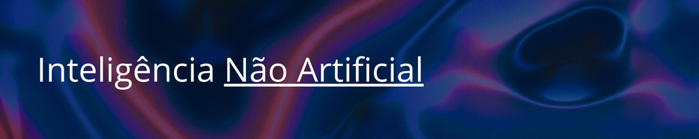

<picture>
    
</picture>

Grupo de estudos em inteligência artificial, formado por [pesquisadores](https://github.com/orgs/inteligencia-nao-artificial-INA/people) que exploram algoritmos, modelos e aplicações de IA em diferentes contextos.

Nossa atuação combina aprendizado colaborativo e desenvolvimento prático, envolvendo:

* Reuniões regulares para discussão de tópicos e novos artigos em [redes neurais](https://pt.wikipedia.org/wiki/Rede_neural_artificial), [aprendizado de máquina](https://pt.wikipedia.org/wiki/Aprendizado_de_m%C3%A1quina) e [inteligência artificial](https://pt.wikipedia.org/wiki/Intelig%C3%AAncia_artificial).
* Participação em hackathons e competições científicas, como [Genomes to Fields (G2F)](https://www.maizegxeprediction.org/) e [Liga Brasileira de Bioinformática (LBB)](https://lbb.rsg-brazil.com/), onde aplicamos técnicas de modelagem preditiva e análise de dados para resolver problemas do mundo real.
* Desenvolvimento e compartilhamento de [software de código aberto](https://pt.wikipedia.org/wiki/Software_de_c%C3%B3digo_aberto), centralizando neste espaço no GitHub todo o código, pipelines, frameworks e experimentos desenvolvidos pelo grupo.

Nosso objetivo é consolidar um ecossistema aberto de pesquisa e desenvolvimento em IA, onde metodologias, benchmarks e resultados podem ser reproduzidos, discutidos e aprimorados pela comunidade.
